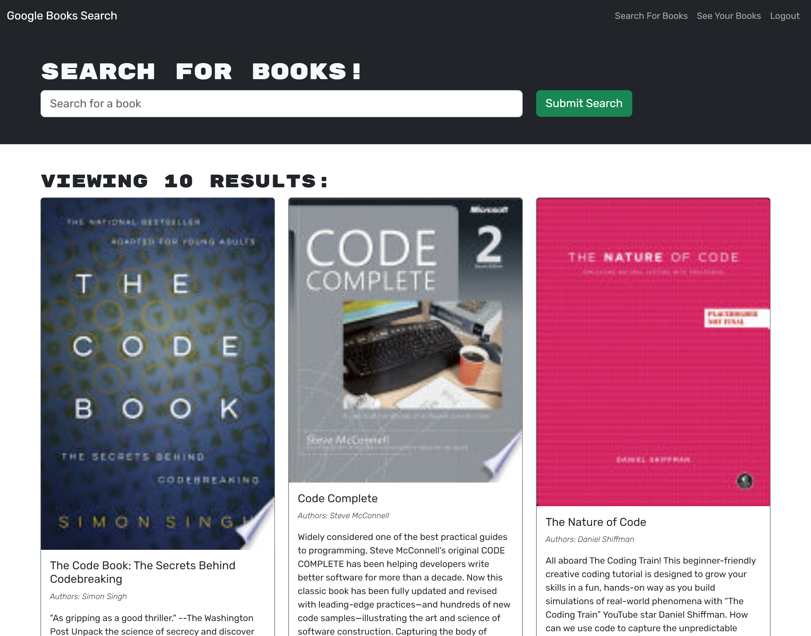

# Google-Books-App
## Description
This is an application that uses the Google Books api and has login functionality to allow users to browse books and save any books they like to an account if they have created one. Uses React as a framework for the front-end and a MongoDb backend, integrated with Apollographql.  
## Table of Contents

- [Description](#description)
- [Installation](#installation)
- [Usage](#usage)
- [Questions](#questions)
## Live Link
[The Application can be found here](https://afternoon-spire-64816-c4061dacc8bf.herokuapp.com/)

## Usage

Create an account or login to an existing account, then enter a search term in the search box. Any books returned can be saved to your account by clicking the blue "Save this Book!" button and viewed later by clicking on the "See Your Books" button.

## Questions
For any questions you can reach out to me at:

My Email: [ziad.t.alfadl@gmail.com](mailto:ziad.t.alfadl@gmail.com)

My GitHub: [https://github.com/Z-Alfadl](https://github.com/Z-Alfadl)
